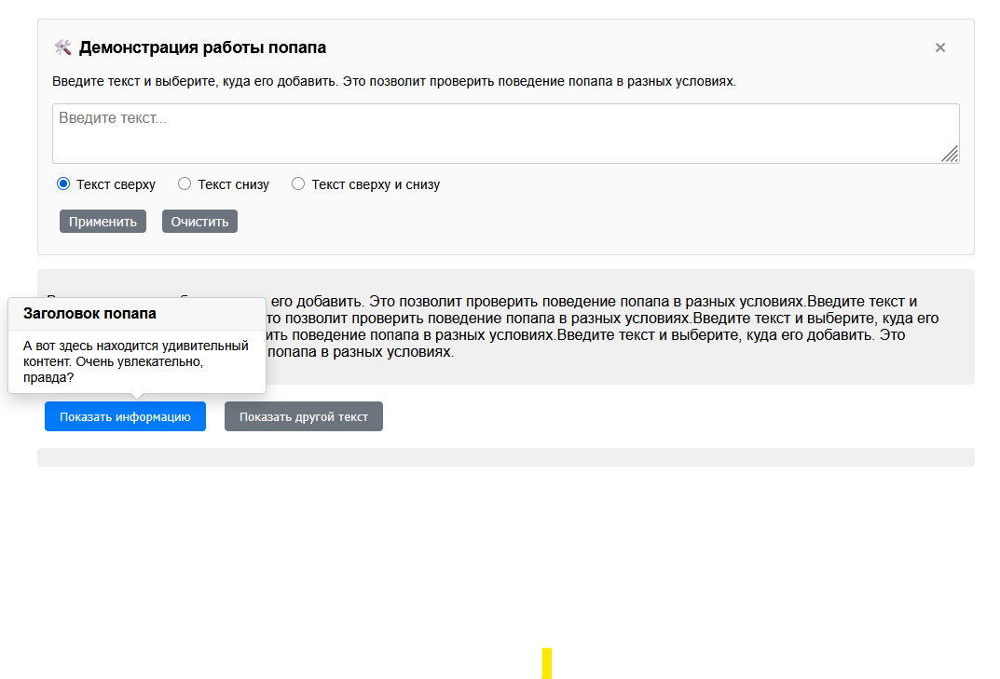

# Popover Widget

[Руководство по настройке Webpack](https://webpack.js.org/guides/)

[Руководство по настройке GitHub Actions](https://docs.github.com/en/actions/quickstart)

[Виджет всплывающих подсказок](https://divk-neto.github.io/HW_11-5_formsHTML/)

> Чистый JavaScript-виджет всплывающих подсказок, аналогичный Bootstrap popover. Работает без jQuery.

## 📚 Документация

- [Функциональность](docs/features.md) — подробное описание возможностей и примеры использования.
- [Установка и запуск](docs/installation.md) — как развернуть проект локально.
- [Тестирование](docs/testing.md) — модульные, интеграционные и e2e-тесты, покрытие кода.
- [Используемые технологии](docs/tech-stack.md) — стек и инструменты разработки.
- [Структура проекта](docs/file-structure.md) — организация файлов и папок.

---

## ✨ Особенности

- Открытие/закрытие по клику.
- Автоматическое позиционирование сверху или снизу с учётом видимой области.
- Адаптивность.
- Настраивается через data-атрибуты.
- Полное покрытие тестами (модульные + e2e).
- Современный инструментарий: Webpack, Babel, ESLint, Prettier, Jest, Puppeteer, GitHub Actions.

---
